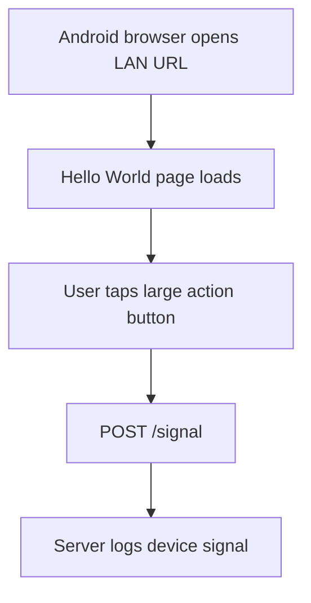
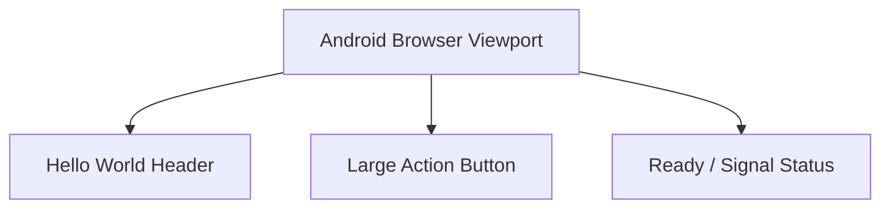

# Cross-Device Communication Mock-ups

## Client interaction

```mermaid
flowchart TD
    A[Android browser opens LAN URL] --> B[Hello World page loads]
    B --> C[User taps large action button]
    C --> D[POST /signal]
    D --> E[Server logs device signal]
```

## Layout sketch

```mermaid
flowchart TD
    Screen[Android Browser Viewport]
    Screen --> Header[Hello World Header]
    Screen --> Button[Large Action Button]
    Screen --> Status[Ready / Signal Status]
```
