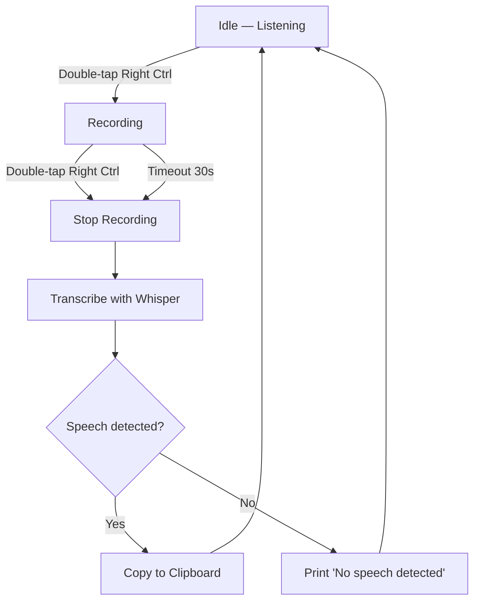
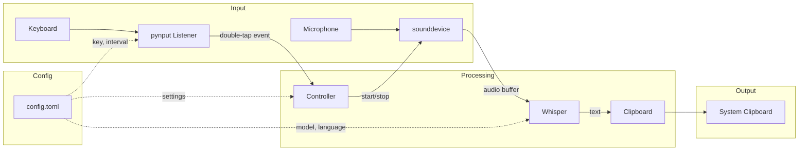
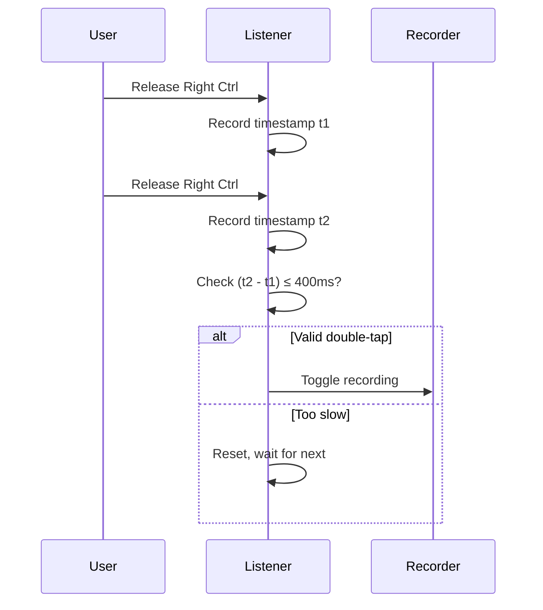
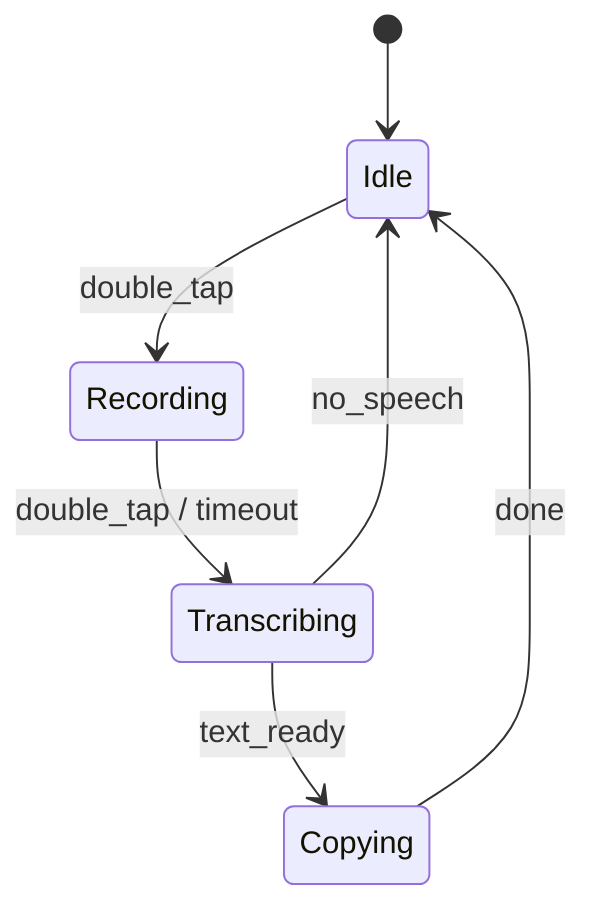

# Mockup flow diagrams — Voice Hotkey

Mermaid diagrams for the voice-hotkey recording flow and application architecture.

---

## 1. Recording flow

---

## 2. Application architecture

---

## 3. Double-tap detection

---

## 4. State machine

